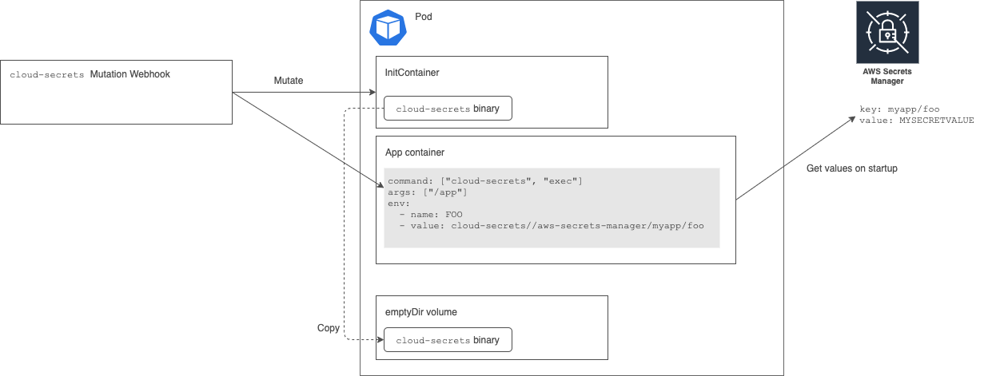

# cloud-secrets

cloud-secrets integrates external cloud secrets store, like AWS Parameters Store or AWS Secrets Manager, with Kubernetes.


## How it works

cloud-secrets is composed of Kubernetes Mutating Webhook and a simple binary which decode secrets.

The mutating webhook injects an InitContainer and it copies `cloud-secrets` binary to an in-memory volume.
The mutating webhook also rewrite entrypoints of containers to run the original command through the `cloud-secrets` binary.

Although `cloud-secrets exec` is designed to work with Kubernetes pods, it works standalone. It traverses environment variables and replaces the variables with decoded one if its values start with `cloud-secrets://` prefix.

```
$ export FOO=cloud-secrets://aws-parameter-store/my-secrets/foo
$ cloud-secrets exec sh -c 'echo $FOO'
FOO_SECRET_VALUE
```

Putting the mutating webhook and `cloud-secrets exec` command together, your application containers can get secrets dynamically with safety way.
Starting the container, `cloud-secrets exec` gets secrets from secret stores and runs the original command after adding the secrets to environment variables. 



## Usage

```deployment.yaml
apiVersion: apps/v1
kind: Deployment
metadata:
  name: myapp
  labels:
    name: myapp
  namespace: default
spec:
  replicas: 1
  selector:
    matchLabels:
      app: myapp
  template:
    metadata:
      labels:
        app: myapp
      name: myapp
      annotations:
        cloud-secrets.daisaru11.dev/enabled: "true"
    spec:
      containers:
        - name: myapp
          image: myapp
          command: ["/myapp"]
          env:
            - name: FOO
              value: "cloud-secrets://aws-parameter-store/myapp-secretes/foo"
            - name: BAR
              value: "cloud-secrets://aws-parameter-store/myapp-secretes/bar"

```

## Related projects

This project is inspired by other projects following.

- [hashicorp/vault-k8s](https://github.com/hashicorp/vault-k8s)
- [banzaicloud/bank-vaults](https://github.com/banzaicloud/bank-vaults)
- [godaddy/kubernetes-external-secrets](https://github.com/godaddy/kubernetes-external-secrets)
